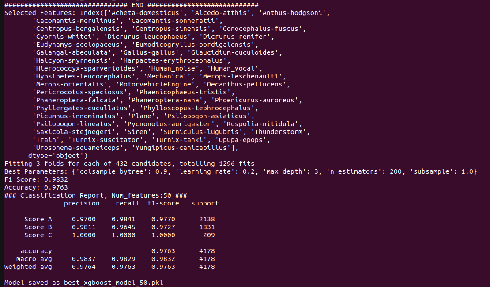
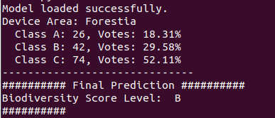

# **Biodiversity Score Level Prediction**

This module offers a step-by-step guide for training a model to predict biodiversity score levels, using a pivot table generated from audio classification results.  

---
## Workflow
- [Setup](#Setup): Installing necessary Python libraries.
- [Data Preprocessing](#Data-Preprocessing): Clean, transform, and prepare the dataset for model training.
- [Model Training](#Model-Training): Build and train the prediction model on the processed data.
- [Inference and Prediction](#Inference-and-Prediction): Use the trained model to make predictions on new data.
---
## Setup

### Requirement
- Python3.10 and above
- numpy
- pandas
- scikit-learn
- xgboost
- seaborn
- matplotlib

The Python libraries can be installed using pip. eg. `pip install numpy`

### Data Preprocessing

- The audio classification predictions serve as the training data for predicting biodiversity scores. They are found in the `./data/csv`.
- A pivot table is used to convert the audio classification predictions into the frequency of appearance for each species. This can be done by simply running the following code in the command line at the current directory, and the output will be `pivot_table.csv`

```bash
python3 scripts/preprocess.py --csv_path ./csv
```

### Model Training

- An XGBoost classification model is used to predict the biodiversity score level.

- The data is first split into training and testing (validation) sets and then normalized using the `StandardScaler` function from the scikit-learn library.

- The objective function is to minimize the cross-entropy loss (logloss) between the ground truth and the predictions.

- `GridSearch` is used for hyperparameter optimization. The optimal number of features is determined using recursive feature elimination, comparing models with 20, 30, 40, 50, 60, 70, and 80 features.

- Below command is for model training and validation.

- Trained model weights are saved in `./results/weights` in best_xgboost_model_{`num_feature`}_{`acc`}_f1_{`f1score`}.pkl format

```bash
python3 scripts/training.py
```

The image below shows an example of the training output, which includes a list of the selected features and the corresponding classification report for the validation set.



### Inference and Prediction

```bash
python3 scripts/preprocess_unseen_data.py
```

##### Preprocess Unseen Data
The unseen(test) data is preprocessed and converted into pivot table using the following command. You can modify the filepath inside the code. The pivot table is saved in `forestia_processed_df.csv` file

##### Prediction
- Copy and paste the selected features obtained from the training.
- Modify the model weight file location.
- Modify the preprocessed data file location.
- Execute the following command.
- If there is a `KeyError` shows up, new columns with value 0 have to be added. Example, `df['Acheta-domesticus'] = 0`
- The prediction result for each example is appended into the dataframe and saved in `bioscore_predictions.csv`.

```bash
python3 scripts/predict.py
```



---

**Scoring Threshold Based on the Forestia results**

The output of the biodiversity score prediction for each row is aggregated by the count of each class prediction and then converted into a percentage contribution. Due to data imbalance in the training distribution, Class C is the majority prediction in almost all cases. To address this issue, we set the following sequential criteria:

If the majority vote contribution for Class B is >13%, the area is assigned Class B.

If the first criterion is not met and the majority vote contribution for Class A is >6%, the area is assigned Class A.

If the first two criteria are not met, the area is assigned Class C.

**Final Score Prediction**

Based on the above criteria, the final biodiversity level prediction score is Class B.
You can see the example results on [`Forestia_results`](./Forestia_results/) folder

---